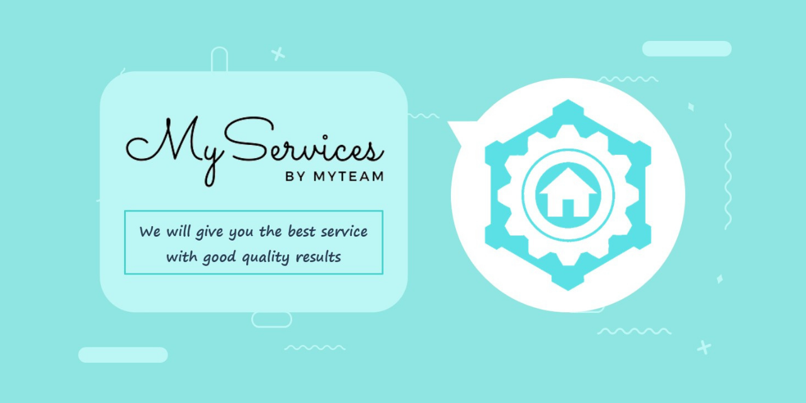

# MyServices Business Idea and Process
This is a final project of the Integrative Survival Experience 2 course that we worked on in a group team called 'MyTeam Group'. This project basically a business idea and includes all the processes needed to start a new business (business logo, slogan, description, vision and mission, SWOT analysis, business model canvas in more detail, pamphlets, social media account, division structure, and UI prototype) but currently, this project has not yet been executed in a real-life. 

Our business idea is called 'MyServices'. MyServices is a marketplace created specifically for service providers and service users based on mobile web apps. So MyServices is like another general marketplace those are BukaLapak, Lazada, and Shopee but in this case, it is selling any services. This business is a modificative business because this business is a modification of several stand-alone service markets out there and we want to combine all of those service markets to be on the same platform to make it easier for service users to find any services through one web application. The example of services that we want to offer is like MyDevice, MyMechanic, MyDriver, MyTailor, etc.

For more detail about our business idea, you may download and read our presentation slides that I have already attached within this repository. 

